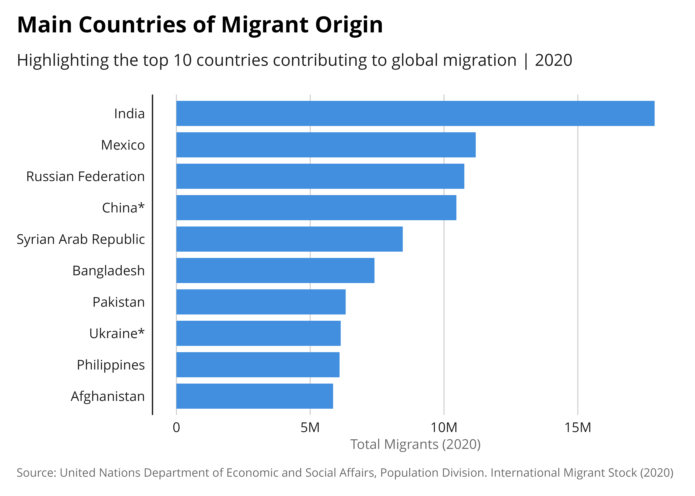

<!-- README.md is generated from README.Rmd. Please edit that file -->

## Overview

<!-- badges: start -->

<!-- badges: end -->

The [International Organisation for Migration](http://iom.int) is part
of the United Nations System. The organisation supports three main
strategic objectives:

1.  Saving lives and protecting people on the move,

2.  Driving solutions to displacement,

3.  Facilitating pathways for regular migration.

`{iomthemes}` R package aims at simplifying the creation of data
visualizations and data stories. This package offers a comprehensive
`{ggplot2}` theme, including built-in customization and color palettes.
It is designed to quickly align reproducible plots with IOM Visual
Branding Recommendations.

## Installation

This package is not yet available on CRAN.

Retrieve the development version from Github using the `{pak}` package:

``` r
install.packages("pak")
pak::pkg_install("iom/iomthemes")
```

## Usage

After loading the `{iomthemes}` package, you can apply the theme to any
`{ggplot2}` chart, by simply either adding a [specific color from one
the palette](https://iom.github.io/iomthemes/reference/iom_pal.html) or
use one of the [color scaling
functions](https://iom.github.io/iomthemes/reference/iom_scale.html) and
[`theme_iom()`](https://iom.github.io/iomthemes/reference/theme_iom.html)
at the end of your plot.

Below is an example using the excel demo dataset from UNDESA bundled
within the package.

``` r
library(tidyverse)
library(iomthemes)

readxl::read_excel(system.file(
  "undesa_pd_2020_ims_stock_by_sex_destination_and_origin.xlsx",
                                           package = "iomthemes"),
  col_types = c("numeric", "text", "text","numeric", "text",
               "text", "numeric",
              "numeric","numeric", "numeric", "numeric","numeric","numeric",
              "numeric", "numeric", "numeric", "numeric", "numeric", "numeric", 
              "numeric","numeric", "numeric", "numeric", "numeric", "numeric",
              "numeric","numeric", "numeric" ), 
  sheet = "Table 1", skip = 9) |>
  ## Getting clean variable names
  janitor::clean_names() |>
  dplyr::rename("total.2020"="x2020_14")|>
  # Add ISO2 country code to identify the country level records 
  dplyr::mutate( 
    origin.iso2 = countrycode::countrycode(
                    location_code_of_origin,
                    origin = "un",
                    destination = "iso2c"),
    destination.iso2 = countrycode::countrycode(
                    location_code_of_destination,
                    origin = "un",
                    destination = "iso2c")) |>
  # Filter out rows where 'origin.iso2' and 'origin.iso2' is NA (missing)
  # We do so to keep only country level records - filter out region subtotal
  filter( !(is.na(origin.iso2)) ) |>
  filter( !(is.na(destination.iso2)) ) |>
  # Group the data by country of origin
  group_by(region_development_group_country_or_area_of_origin) |>
  # Summarize the total number of migrants for the year 2020 & remove NA! 
  summarise(total_migrants_2020 = sum(total.2020, na.rm = TRUE)) |>
  # Arrange the summarized data in descending order of total migrants
  arrange(desc(total_migrants_2020)) |>
  # Select the top 10 countries of origin with the highest number of migrants
  slice_head(n = 10)  |>
  ggplot(
    aes(x = reorder(region_development_group_country_or_area_of_origin,
                    total_migrants_2020),
             y = total_migrants_2020)) +
  # Define it as a bar chart and apply IOM color palette
  geom_bar(stat = "identity",
           ## Apply IOM color palette!
           fill = iomthemes::iom_pal(n = 1, name= "pal_blue"),
           width = 0.8) +
  # Flip the chart to make it more legible
  coord_flip()  +
  ## Format the labels for the x axis
  scale_y_continuous(
    labels = scales::label_number(scale_cut = scales::cut_short_scale())) +
  labs(
    title = "Main Countries of Migrant Origin",
    subtitle = "Highlighting the top 10 countries contributing to global
                migration | 2020",
       x = "Country of Origin",
       y = "Total Migrants (2020)",
       caption = "Source: United Nations Department of Economic and Social 
       Affairs, Population Division. International Migrant Stock (2020)") +
  ## and apply IOM theme
  iomthemes::theme_iom(grid = "X", axis = "Y", axis_title = "X")
```



You can explore examples of `{iomthemes}` in action through the [package
vignette](iomthemes.html).

This package can and should be used in conjunction with
[{iomdown}](https://iom.github.io/iomdown) to make reproducible reports
and [{iomquarto}](https://iom.github.io/iomquarto) to develop web pages,
presentation and data scrolly-telling.

## Contribution and Code of Conduct

Contributions to `{iomthemes}` are highly valued. To ensure a welcoming
and inclusive community, we follow our [Contributor Code of
Conduct](https://contributor-covenant.org/version/2/0/CODE_OF_CONDUCT.html).

If you have suggestions, uncover bugs, or envision new features, kindly
submit an [issue on GitHub](https://github.com/iom/iomthemes/issues).

To contribute code, do not hesitate to fork the repository and create a
pull request. Note that the package is maintained with [Fusen
package](https://thinkr-open.github.io/fusen/). All functions are
document in
[`dev/fusen_dev.Rmd`](https://github.com/iom/iomthemes/blob/master/dev/fusen_dev.Rmd).

## License

This package is distributed under the [MIT
License](https://github.com/iom/iomthemes/blob/master/LICENSE.md).

## Acknowledgements

This package build on the Open Source work done from many contributors.

Credits goes to the work from my former colleague, [Cedric
Vidonne](https://www.youtube.com/watch?v=Ypf9ngq5EQA), the main author
of `{unhcrthemes}`.
